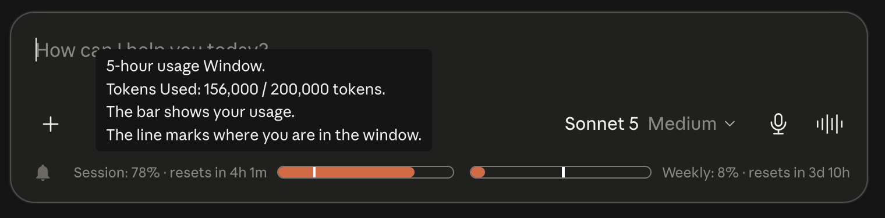

# Claude Token Counter

A browser extension that shows estimated token usage, cache timers, and session/weekly usage bars directly on claude.ai.

## 1. What It Does

### 1.1 Live Token Count

Shows an approximate token count for the current conversation, with a mini progress bar scaled to Claude's 200k (estimated) token context limit.

### 1.2 Session and Weekly Usage Bars (Pacer Bars)

Shows

### 1.3 Session and Weekly Usage Bars

Shows your 5 hour session usage and 7 day usage windows, each with a countdown to when the window resets.

### 1.4 Prompt Estimator

As you type in the composer, shows a live estimated token count for your draft, including attached images.

### 1.5 Image Token Estimation

Estimates the token cost of attached images based on their pixel dimensions.

### 1.6 Notification Bell

Optional browser notifications when your 5 hour or 7 day usage window resets.

## 2. How to Install It

### 2.1 Chrome, Edge, and Other Chromium Based Browsers

1. Download or clone this repository to a folder on your computer.
2. Open your browser and go to the extensions page:
   - Chrome: `chrome://extensions`
   - Edge: `edge://extensions`
   - Other Chromium browsers: usually `browser://extensions`
3. Turn on **Developer mode** (usually a toggle in the top right corner).
4. Click **Load unpacked**.
5. Select the project folder (the one containing `manifest.json`).
6. The extension is now installed. Open or refresh claude.ai to see it.

**[Screenshot placeholder: Load unpacked button in chrome://extensions]**

### 2.2 Firefox

Firefox requires extensions to be signed before they can be permanently installed, so there are two options.

#### 2.2.1 Option A: Temporary Install (for testing, resets on browser restart)

1. Download or clone this repository to a folder on your computer.
2. Go to `about:debugging#/runtime/this-firefox`.
3. Click **Load Temporary Add-on**.
4. Select the `manifest.json` file inside the project folder.
5. The extension stays active until Firefox is closed. You will need to reload it each session.

#### 2.2.2 Option B: Userscript (works on Firefox and other browsers, does not require reloading)

1. Install a userscript manager such as Tampermonkey or Violentmonkey.
2. Open the userscript manager's dashboard and choose to create or import a new script.
3. Copy the contents of `userscript/claude-counter.user.js` from this repository into the new script, or import the file directly.
4. Save the script and make sure it is enabled.
5. Open or refresh claude.ai to see it.

Note: this extension targets Firefox 142 and newer, as declared in `manifest.json`.

## 3. How It Works

- A content script runs on claude.ai and injects a small page level script (`src/injected/bridge.js`) into the page. This is needed because some of the data the extension reads is only available from inside the page's own JavaScript context, not from a content script.
- The injected script wraps the page's `fetch` calls so it can observe:
  - Conversation tree requests, used to read the full message history and compute token totals.
  - Usage endpoint responses and streamed message limit events, used for the session and weekly usage bars.
  - Generation start events, used to trigger the cache timer.
- The content script and injected script communicate through `window.postMessage`, since they run in separate JavaScript contexts.
- Token counts are calculated locally in your browser using the `o200k_base` tokenizer vendored from the gpt-tokenizer project (see Credits below). No conversation content is sent to any third-party server for counting.
- The extension walks the conversation's message tree from the current leaf backward to the root to reconstruct the currently visible trunk of messages, then tokenizes the visible text, tool calls, and tool results in that trunk. Token counts per message are cached by a hash fingerprint so unchanged messages are not re-tokenized.
- For the composer, the extension reads the current draft text and any attached images, estimating image token cost from each image's pixel dimensions, and debounces recalculation as you type.
- Usage bars and reset countdowns are built from your organization's usage data, obtained either from the usage endpoint or from server-sent usage events, and are re-synced periodically.

## 4. Credits

Token counting via [gpt-tokenizer](https://github.com/niieani/gpt-tokenizer) (MIT)

## 5. Limitations

- **Approximate, not exact**: token counts use a generic tokenizer (`o200k_base`) rather than Claude's own tokenizer, so counts may differ from what Claude actually uses.
- **Excludes the system prompt**: the token count only reflects the visible conversation, not any hidden system prompt.
- **Images only**: attachment token estimation covers images. Other document types (PDFs, text files, and so on) are not estimated (idek if its possible without making the extension heavier).
